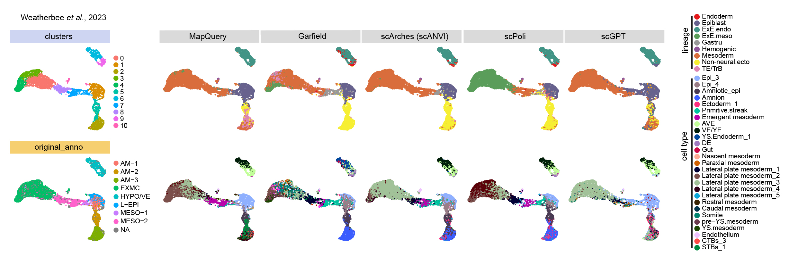
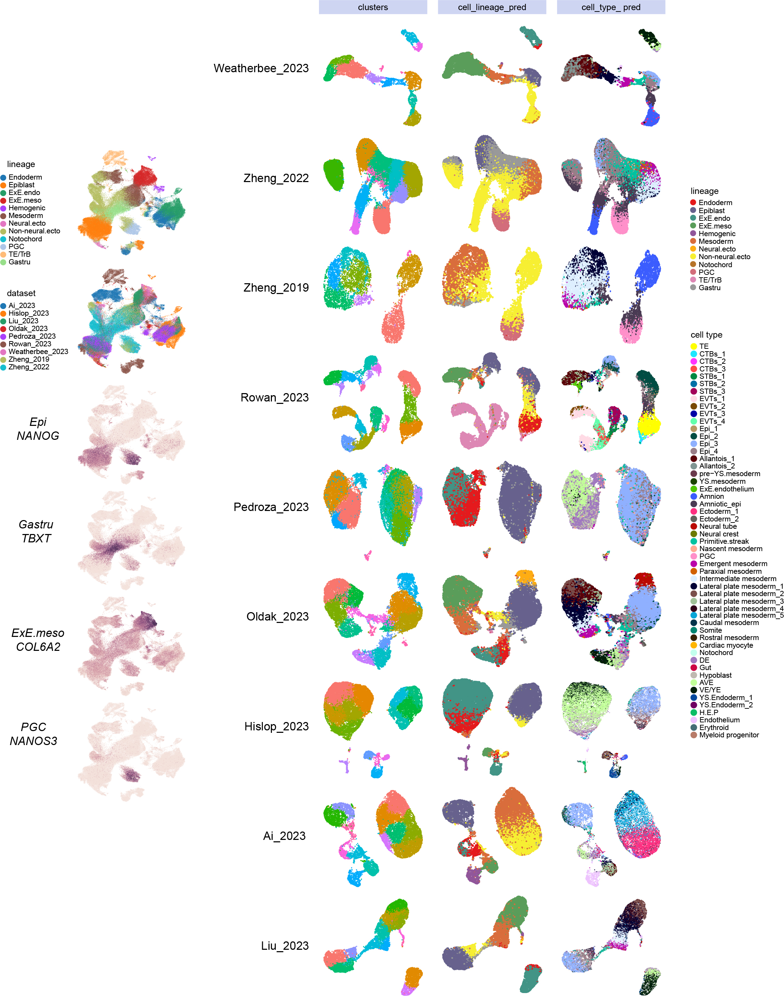

## mapping-to-Post-implantation-developmental-reference

Currently, five state-of-the-art methods were compared in this study to evaluate their performance in single-cell data reference mapping. 
The goal of this comparison is to provide researchers with a comprehensive overview of each method's performance.

## benchmarking transfer learning methods

| Method    | Language | Mapping Logic                                                                                     | Link                                                                                                   |
|-----------|----------|---------------------------------------------------------------------------------------------------|--------------------------------------------------------------------------------------------------------|
| MapQuery  | R        | Finds anchors between reference and query data to align datasets.                                | [Link](https://satijalab.org/seurat/articles/integration_mapping)                                     |
| Garfield  | Python   | Builds a reference graph and maps query data by leveraging neighborhood relationships.           | [Link](https://garfield-bio.readthedocs.io/en/latest/?badge=latest)                                   |
| scArches  | Python   | Trains a reference model and fine-tunes it with query data.                                      | [Link](https://docs.scarches.org/en/latest/scanvi_surgery_pipeline.html)                              |
| scPoli    | Python   | Trains a reference model and fine-tunes it with query data.                                      | [Link](https://docs.scarches.org/en/latest/scpoli_surgery_pipeline.html)                              |
| scGPT     | Python   | Embeds both reference and query data into a foundation model for unified representation.          | [Link](https://github.com/bowang-lab/scGPT/blob/main/tutorials/Tutorial_Reference_Mapping.ipynb)      |

# To enhance annotation accuracy, we optimised our training model. The enhanced model provides better predictive performance

This repository provides tutorials and code snippets for all the methods mentioned above, showcasing their application in the auto-annotation of query datasets. Additionally, resources are included to help you evaluate and select the most suitable tool for your research needs.
